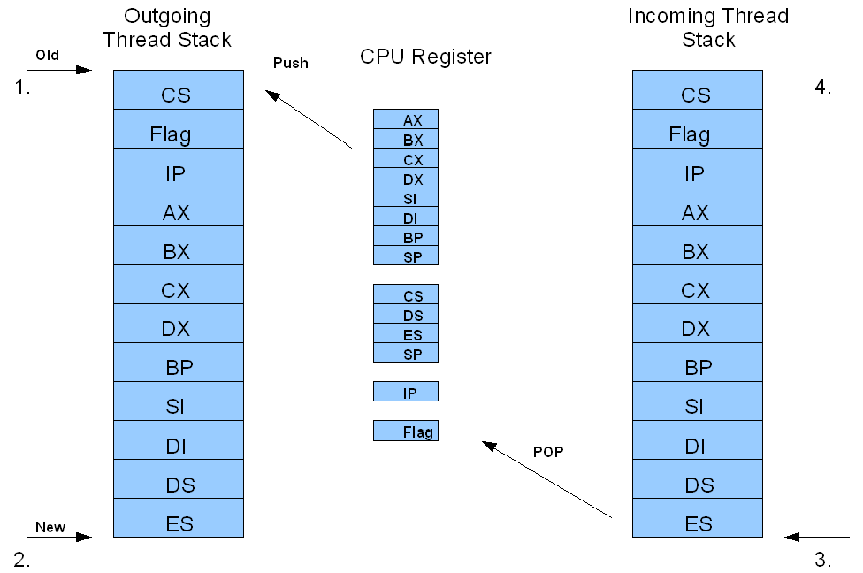

Phoenix Developer's Guide
=========================

The Bootloader
--------------

### Stage 1 (boot.asm)

The first stage of the boot loader is called the bootstrap and is loaded in to
the first sector on the disk (512 bytes). This stage's goal is to load the
second stage.

### Stage 2 (loader.c)

The second stage is a com file and can be as big as 64kB. This stage's goal is
to load the operating system and jump to it. The operating system and the game
are combined in single executables that have no size limitation. Be aware that
the current stage two boot loader may have to be modified to support executables
larger than 64kB.

1. Get boot sector information: Call `get_boot_sector_info`. 
2. Read root directory: Call `search_root`. This returns the starting cluster of
   the chosen file.
3. Read FAT: Call `load_file`. 
4. Get the exe header: Call `get_exe_header_info`. 
5. Process relocation table: Call `setup_exe`. 
6. Setup the PSP: Call `setup_PSP`. DS and ES are setup to point at the PSP.
   This step is not currently doing anything, but will be needed if you ever
   want to pass in command line arguments when loading the operating system.
7. Jump to executable: The start of the program is after the header so CS needs
   to be offset by the start of the file plus the size of the header.

The Kernel
----------

### Thread Switching

The kernel use a timer interrupt to handle the thread switching. There are two
main functions for thread switching, `Timer_ISR` in `xtimer.c` and
`Timer_ISR_asm_` in `xt_asm.asm`. Any changes that are made to these two
function might cause the function `xthread_create` in `xthread.c` to have
synchronization issues.

When the timer interrupts, it jumps to the new timer interrupt handler
`Timer_ISR_asm`. First it saves the CPU registers and records the current stack
pointer for the outgoing thread. Note: Each thread gets its own unique stack and
the stack pointer is saved for thread switching. Then it calls `Timer_ISR` to
find the next runnable thread, which then returns the incoming thread stack
pointer. Finally, it replaces the current stack pointer with the incoming thread
stack pointer, than restores all the CPU registers. Once the CPU register is
restored, it will start executing the incoming thread.

### Message Passing

The message passing system is contained in the files `message.h` and `xbuffer.h`
and their corresponding c files. 

`xbuffer` is a producer/consumer buffer which handles the storage of pointers to
messages which are being passed between modules. Pointers to messages can be
pushed onto the buffer and then be popped back off using either the source and
destination or just the destination. The semaphores implemented in the same
files should ensure that nothing can be pushed when the buffer is full or popped
when it is empty. The semaphores depend on mutexes and conditions that are
implemented in `xthread.c`.

The message system itself uses an xbuffer and is has four important functions:
send, throw, receive, and reply.

Send is used when the caller needs a response, so the call takes pointers to
request and response message structures. The request structure contains whatever
is needed for the receiving end to process the message, usually an enumerated
function name and arguments. The response structure is just space that can be
written to when the request is replied to. When send is called both of these
pointers are pushed onto the xbuffer and the destination thread is set so that
it can be run the next time it is selected. The calling thread is made
unrunnable and then the kernel is told to switch threads.

Throw is used when the caller does not need a response and only needs to send a
message. The request is laid out the same way as in send. When throw is called
the pointer is pushed onto the xbuffer and the destination is set to runnable,
but the calling thread is not switched out of and is able to keep running.

Receive is used to get messages to process and is usually used by parsers within
the modules. If receive is called and there are no available messages the thread
will be made unrunnable and will wait until a message is sent to it, at which
point it will be run the next time the kernel chooses it, returning with a
filled in message to process. If a message is available receive will return with
a filled message. Either way should look identical to the thread calling
receive.

Reply is used to respond to messages the were sent with send. It will fill in
the response message given to send and make the original sender runnable.

Modules
-------

### Video

The video module is split up in to three files. The `video.c` file contains
standard functions that can be used in the default mode. Once `set_mode` is used
with `VGA_MODE` as the parameter, all the vga functions become available.  At
this point `vga_print_at` must be used instead of `print_at` to print text to
the screen.

To use `put_image` or `put_trans_image` an image must be created and added to
`images.c` first. First create an image in your favorite image manipulator
program (gimp). Then convert the image to indexed using the optimized palette
with 256 colors. Then save image as a bmp. Use `bmp2hex` in the tools folder to
convert the image to usable code. Copy the code in to `images.c` and modify the
names to your liking. You will then need to modify the `get_image` function to
include the new image and palette. Note: Changing the palette will alter all the
colors on the screen. If you do not want to do this, you can set the palette to
`NULL` in the structure.

`video.c`: Supports text Mode: 16 colors, 80x25 characters. Functions:
`print_at,` `clear_screen,` and `set_mode`. 

`vga.c`: Supports VGA mode: 256 colors, 320x200 pixel resolution, 40x25
characters. Functions: `print_at,` `put_pixel,` `get_pixel,` line, rectangle,
polygon, circle, `put_image,` `put_trans_image`. 

`Images.c`: Stores the images used in programs.

### Keyboard

The keyboard module is interrupt driven. At this point the keyboard modules will
only support US standard keyboards. The `keyboard.c` contains the interrupt
handler, which it will also decode scan code read from keyboard. There is only
one function is used in our kernel via `getKey`. The `getKey` function returns
the last key press. The return values are ASCII for ASCII values or scan code
for non ASCII values.

Due to time constraints, the keyboard modules doesn't support Caps lock, Num
lock, or any other locks.

### Audio

At this point the audio module is fairly primitive. The `beep.c` file only uses
the internal speaker. To call, the beep function, you pass in a note name that
corresponds to a frequency found in `beep.h`. It will play that note for a while
and then stop. The duration of the note depends on the speed of the system. 

An obvious improvement would be to add the ability to pass in a note duration
and use the system clock to count it and an interrupt to end it. 

### Creating a Module

Modules are made up of a few different parts. The module itself is usually a
group of functions to provide a common set of abilities, such as the video
module providing functions to display things. There may be an IRQ to handle
hardware interrupts as well. To be useful to other modules or threads a parser
must be written and a corresponding library of helper functions should be
written as well.

The parser is written as a pointer to a function so that it can be run as a
thread. The parser should continually try to receive messages and attempt to do
whatever the messages ask. In the current parsers, the enumerated function is
read and used in a switch to determine which function the message is trying to
call. Each case will call a `try_function_name` which reads over the remainder
of the message data and tries to extract the necessary arguments to call the
actual function. If the arguments appear to be OK the function is called,
otherwise the try fails and returns. Once try returns, regardless of success or
failure, the parser will call reply if the message was sent with `message_send`
and then call receive again, or if sent with throw only receive will be called.

The library should be created in the RTL folder and should contain functions
with identical names and arguments to the functions in the module, except with
names prepended with the module name, eg. `xvideo_print_at` instead of
`print_at`. These functions should build messages that contain the information
that the parser expects, in the case of the current modules the helper functions
build messages with an enumerated function name and the arguments necessary to
call the actual function.
